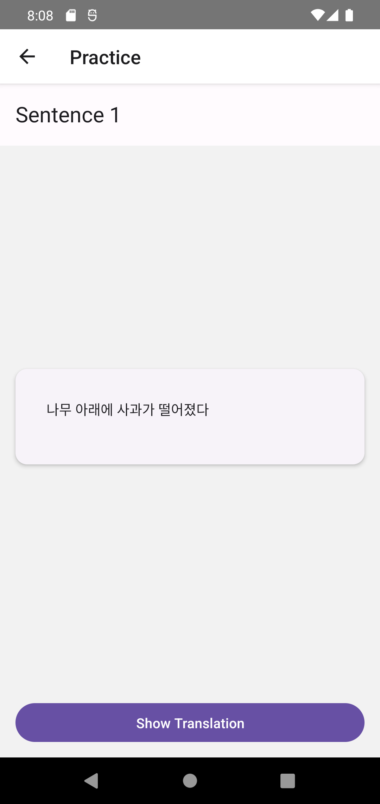

#  FluentMind
FluentMind is a mobile app design to help imtermediate and advanced language learners improve their reading and listening skills through personalized sentences. By leveraging AI, Fluentmind crafts practice session tailored to the user's desired learning level that is engaging and new while avoiding generic repetitive practice.

## Built With
- React Native: core UI framework
- AWS DynamoDB: reliable cloud storage
- AWS Appsync & Lambda: Handling API calls between app and cloud storage
## Supported Languages
- Korean
